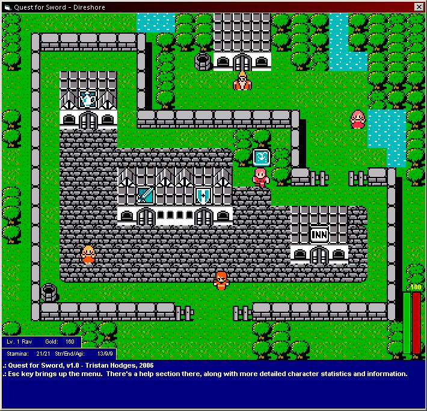



## Quest for Sword \- 80% done RPG \-No DirectX\-

### Description

The game is 80% because the content is not fully finished. About 10 maps from the eastern side of the world do not exist. The game itself, engine-wise, is 100% done and you will be able to play for atleast an hour to an hour and a half without running out of areas to explore.

Before you hop in, the game is hard. Think wisely. Always have potions and bandages, and stay in areas until you know you can make it to the next one.

All of the music (except the battle theme) was composed and orchestrated by me.

The graphics are all from Final Fantasy 1, but I did a lot of tweaks to them (grass/sand/dead trees/different colored buildings)

The game has all sorts of interesting new ideas to RPGs in general.

For instance, each weapon in the game can be sharpened. It can be a dull weapon, or a razor sharp weapon. The sharper it is, the more your enemy will bleed when you cut him. The game uses a Blood/Stamina relationship, where, bluntly, the lower your stamina is, the less you'll be able dodge/block attacks, and the more you'll be grazed or cut in battle.

There are more things like that, so just try the game! There's ingame tutorials, as I realize it might be difficult to get acustomed to.
 
### More Info
 

             |
---                |---
**Submitted On**   |2006-06-16 15:18:08
**By**             |[Tristan Hodges](https://github.com/Planet-Source-Code/PSCIndex/blob/master/ByAuthor/tristan-hodges.md)
**Level**          |Advanced
**User Rating**    |4.8 (19 globes from 4 users)
**Compatibility**  |VB 5\.0, VB 6\.0
**Category**       |[Games](https://github.com/Planet-Source-Code/PSCIndex/blob/master/ByCategory/games__1-38.md)
**World**          |[Visual Basic](https://github.com/Planet-Source-Code/PSCIndex/blob/master/ByWorld/visual-basic.md)
**Archive File**   |[Quest\_for\_2001346162006\.zip](https://github.com/Planet-Source-Code/tristan-hodges-quest-for-sword-80-done-rpg-no-directx__1-65687/archive/master.zip)

